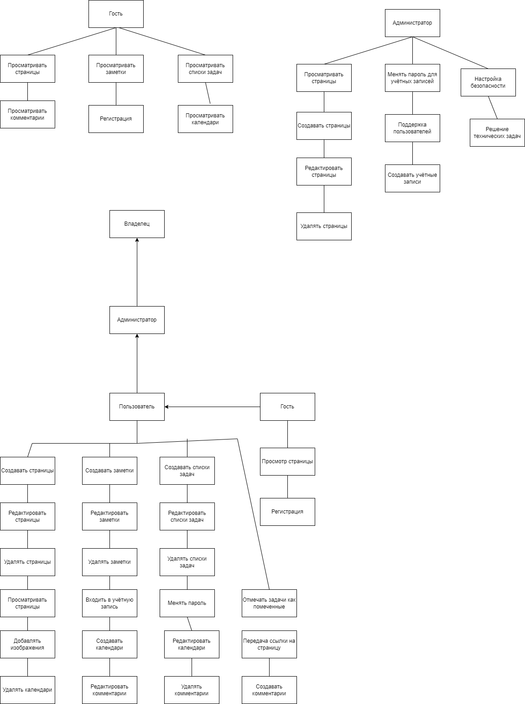
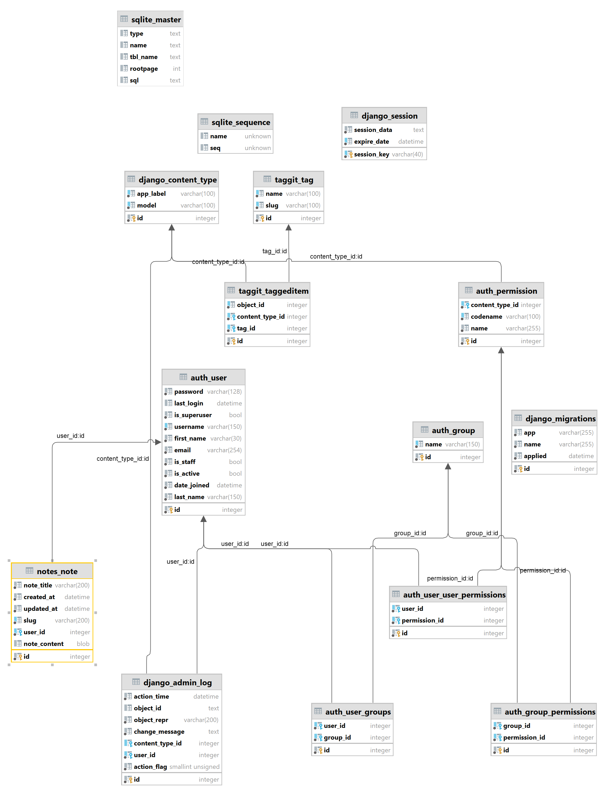
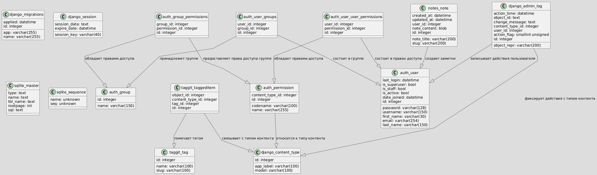
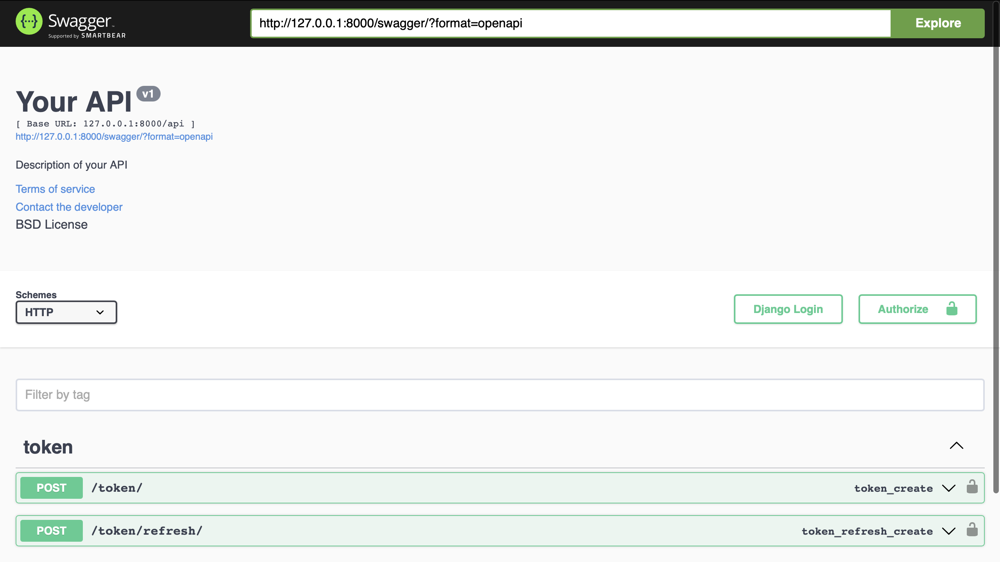
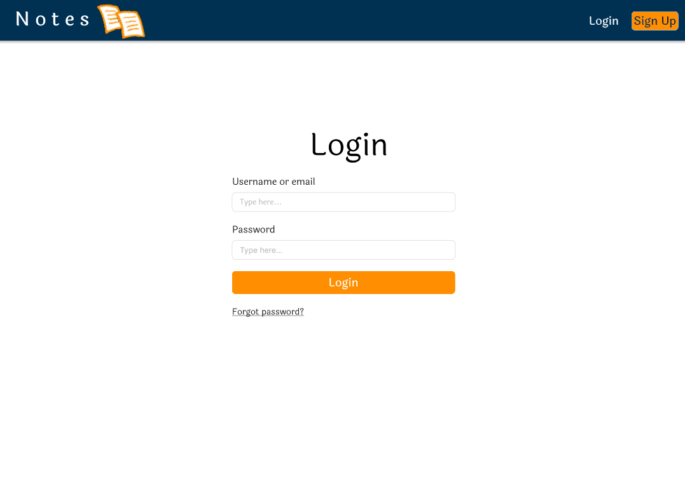

# Notes
## Содержание

### [Backend](#backend)

### [Frontend](#frontend)

# Backend
## Описание проекта

Notes — это гибкая платформа для создания,организации и управления информацией, объединяющая функции заметок, 
баз данных и планирования. Пользователи смогут создавать страницы с текстом, таблицами, списками задач, встроенными
медиа. Основная идея — предоставить универсальный инструмент для работы и личного использования, который позволит
пользователям легко организовывать свои проекты, задачи, цели и заметки в одном месте.

## Стек используемых технологий

<h4>Фреймворки и библиотеки для веб-разработки:</h4>
<ul>
<li>Django (4.2)
<li>djangorestframework (3.15.2)
<li>django-crispy-forms (2.3)
<li>django-taggit (6.0.0)
<li>Django Summernote (0.8.20.0)
<li>djangorestframework-simplejwt (4.5.0)
</ul> 
<h4>Для работы с JSON, API и веб-запросами:</h4>
<ul>
<li>jsonschema (4.23.0)
<li>requests (2.32.3)
<li>httpcore (1.0.5)
<li>urllib3 (2.2.2)
<li>fastjsonschema (2.20.0)
</ul>
<h4>Для обработки документов и работы с PDF:</h4>
<ul>
<li>reportlab (4.0.9)
<li>xhtml2pdf (0.2.16)
<li>pypdf (5.0.0)
<li>PyPDF2 (1.26.0)
</ul>
<h4>Для работы с SQL и базами данных:</h4>
<ul>
<li>sqlparse (0.5.1)
<li>oscrypto (1.3.0)
</ul>

## Роли пользователя

### Владелец
##### Пользователь с полными правами на управление системой, который может настраивать параметры, управлять пользователями и разрабатывать новые функции.

### Администратор
##### Пользователь, ответственный за управление учетными записями, поддержку пользователей и настройку безопасности системы.

### Гость
##### Пользователь с ограниченным доступом к системе. Может просматривать общедоступные страницы, но не может вносить изменения. Может подать запрос на создание учётной записи (зарегестрироваться)

### Пользователь
##### Пользователь с полным доступом к системе. Может входить в учётную запись. Может создавать, редактирвать и удалять страницы. Может создавать заметки, таблицы, календари, комментарии на страницах. Может добавлять изображения на страницы. Может делиться странцицами.

Система создания, организации и управления информацией. Владелец системы управляет учётными записями пользователей, которые предоставляются после регистрации и данными, привязанными к ним, и управляет параметрами системы и создаёт функции, которые влияют на опыт использования системы. Также владелец создает страницу для записи пользователем информации и предоставляет пользователю доступ на редактирование. Администратор системы управляет настройками безопасности, обеспечивает поддержку пользователей и решает технические вопросы. Гость системы может послать администратору запрос на заведение учётной записи, в этом случае происходит автоматическое создание новой учётной записи, которая требует подтверждения от владельца, после которого такая учётная запись будет доступна для использования. Также гость может просматривать страницы других пользователей и войти в существующую учётную запись. Пользователь системы может редактировать созданные страницы, добавлять таблицы, списки задач, календари, комментарии, изображения на страницы. Также пользователь может послать администратору запрос на изменение пароля с деталями о новом пароле, в этом случае происходит автоматическая генерация нового пароля, которая требует от владельца подтверждения, после которого такой пароль будет использоваться для получения пользователем доступа к учётной записи. Также пользователь может поделиться страницей.

## База данных

 Для использования была выбрана база данных MySQL, как наиболее простая для использования,
и, самое главное, хорошо совместимая со всеми библиотеками

## API маршруты

<h4>Аутентификация</h4>
<ul>
<li>POST /api/token/ – Получение JWT токена.
<li>POST /api/token/refresh/ – Обновление JWT токена.
</ul>

<h4>Пользовательские действия</h4>
<ul>
<li>GET /accounts/signup/ – Страница регистрации пользователя.
<li>GET /accounts/login/ – Страница входа (редирект если пользователь уже аутентифицирован).
<li>GET /accounts/logout/ – Выход из аккаунта.
<li>GET /accounts/change_password/ – Изменение пароля.
</ul>

<h4>Работа с заметками</h4>
<ul>
<li>GET /notes/ – Домашняя страница с заметками (требуется авторизация).
<li>GET / – Домашняя страница.
</ul>

<h4>Организация сетевого взаимодействия</h4>

Сервер в данный момент доступен через hamachi. Для подключения необходимо подключиться к существующей сети LensonNet. Сам сервер будет доступен по адресу http://25.31.176.32:8000 (как в hamachi организовать https еще не догадались :))

График работы сервера - в разработке. Ответственный - https://t.me/DancingWithTheSunRays

# Frontend

## Описание проекта
### [Описание проекта можно прочесть выше](#описание-проекта)

## Стек используемых технологий

<ul>
<li>Figma – Используется для проектирования интерфейсов, прототипирования и создания макетов пользовательского интерфейса (UI).
<li>Bootstrap – Фреймворк для быстрой и адаптивной верстки, используемый для реализации интерфейса на фронтенде.
</ul>

## Прототипы страниц

### [Десктопный дизайн](https://www.figma.com/design/nfZD6QHBtFL7f2xXTvDdAw/Comp)
### [Мобильный дизайн](https://www.figma.com/design/tRNl6nzTKKYvTG7Kk6PSpr/mobile)
### [Планшетный дизайн](https://www.figma.com/design/NLEtUPq2fvkz7y9cIObh0M/Untitled)

## API
### [API можно прочесть выше](#api-маршруты)
